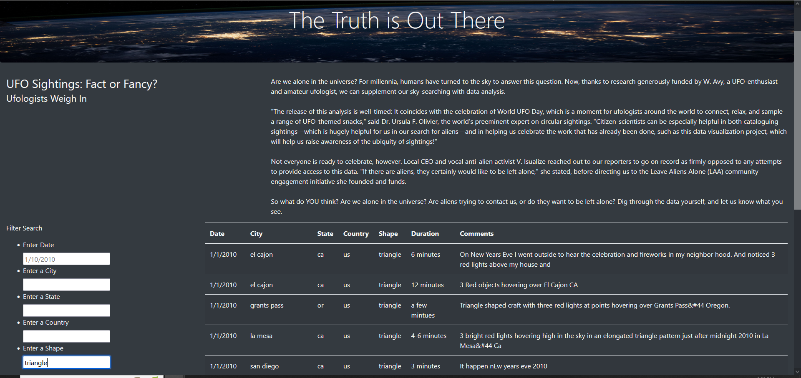

# UFO-Sightings
## Overview of the analysis:
The client have a working webpage with dynamic talbe for UFO tracking. However she wants to make the site more robust by allowing users to filter on multiple criteria at the same time. We will be adding filters to allow the users to not only filter by date but by city, state, country, and shape. 

## Results:
Below are examples of some of the new searches that can now be performed.

City filter

State filter

Shape filter

## Summary:
There are several drawbacks of this webpage. One of these drawbacks is that it is case sensitive. Dana should have someone review the code so that searches can be done without have to match exactly.

Two additional enhancement recommendations would be to add a button to clear all entered search criteria for new searches as well as an interactive map that would allow the user to click on a certian region or country. 
